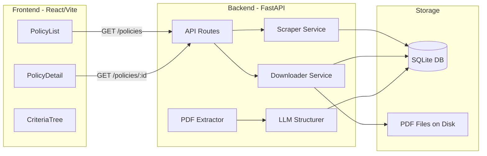

# Oscar Medical Guidelines Scraper + Tree Explorer

## Architecture




## Directory Structure

```
full-stack-feb/
├── backend/
│   ├── app/
│   │   ├── main.py              # FastAPI app entry, CORS config
│   │   ├── database.py          # SQLAlchemy engine + session (SQLite)
│   │   ├── models.py            # 3 tables: policies, downloads, structured_policies
│   │   ├── schemas.py           # Pydantic request/response models
│   │   ├── routers/
│   │   │   ├── policies.py      # GET /policies, GET /policies/{id}
│   │   │   └── pipeline.py      # POST endpoints to trigger scrape/download/structure
│   │   └── services/
│   │       ├── scraper.py       # Discover PDFs from Oscar page
│   │       ├── downloader.py    # Download PDFs with retry + throttle
│   │       ├── extractor.py     # PDF -> text via pdfplumber
│   │       └── structurer.py    # Text -> LLM -> validated JSON tree
│   ├── pdfs/                    # Downloaded PDF storage
│   ├── requirements.txt
│   └── oscar.db                 # SQLite database (gitignored)
├── frontend/
│   ├── src/
│   │   ├── App.tsx
│   │   ├── api/client.ts        # Axios/fetch wrapper
│   │   ├── types/index.ts       # TypeScript types mirroring backend schemas
│   │   ├── pages/
│   │   │   ├── PoliciesPage.tsx  # Policy list with structured indicator
│   │   │   └── PolicyDetailPage.tsx
│   │   └── components/
│   │       └── CriteriaTree.tsx  # Recursive expand/collapse tree
│   ├── package.json
│   └── vite.config.ts
├── oscar.json                   # Reference schema (existing)
├── .env.example                 # GROQ_API_KEY placeholder
└── README.md                    # Updated with setup + run instructions
```

## Key Technical Decisions

### 1. Database (SQLAlchemy + SQLite)

Three tables matching the spec's data model:

- **policies**: `id`, `title`, `pdf_url` (unique), `source_page_url`, `discovered_at`
- **downloads**: `id`, `policy_id` (FK), `stored_location`, `downloaded_at`, `http_status`, `error`
- **structured_policies**: `id`, `policy_id` (FK), `extracted_text`, `structured_json` (JSON), `structured_at`, `llm_metadata` (JSON), `validation_error`

Idempotency: `INSERT OR IGNORE` on `pdf_url` uniqueness for reruns.

### 2. Scraper (`scraper.py`)

- Use `requests` + `BeautifulSoup` to parse [the Oscar guidelines page](https://www.hioscar.com/clinical-guidelines/medical).
- Extract all `<a>` tags whose `href` points to a PDF (or links to guideline sub-pages containing PDFs).
- May need to follow sub-page links (e.g., `/medical/cg013v11`) to find the actual PDF download URL.
- Throttle with `time.sleep()` between requests (1-2s).

### 3. Downloader (`downloader.py`)

- Stream-download each PDF to `backend/pdfs/{policy_id}.pdf`.
- Retry logic: up to 3 attempts with exponential backoff via `tenacity` or manual loop.
- Record `http_status` and `error` in the downloads table.
- Rate-limit: 1-2 second delay between downloads.

### 4. PDF Text Extraction (`extractor.py`)

- Use **pdfplumber** (superior to PyPDF2 for medical docs with tables/structured text).
- Extract all pages, concatenate text.
- Store the extracted text in `structured_policies.extracted_text`.

### 5. LLM Structuring (`structurer.py`)

- Use **Groq** (free tier) with **Llama 3 70B** (`llama-3.3-70b-versatile` or latest available).
- Groq's API is OpenAI-compatible, so we use the `openai` Python SDK with a custom `base_url="https://api.groq.com/openai/v1"` and `api_key=GROQ_API_KEY`.
- Prompt strategy:
  - System prompt: include the `oscar.json` schema as the target format, instruct to respond only with valid JSON.
  - User prompt: include the extracted PDF text + explicit instruction to extract only "initial" criteria.
  - Use `response_format={"type": "json_object"}` (supported by Groq).
- **Validation**: Validate LLM output against a Pydantic model matching the recursive `rules` schema. Store any validation errors in `validation_error`.
- **Initial-only selection logic**: Instruct the LLM to identify and extract only the "Initial" / "Initial Authorization" criteria section, ignoring "Continuation" criteria. As a fallback, if no clear initial/continuation distinction exists, extract the first complete criteria tree. Document this in README.
- **Rate limits**: Groq free tier has rate limits (~30 req/min). Add delays between structuring calls.

### 6. API Endpoints


| Method | Path                      | Purpose                                      |
| ------ | ------------------------- | -------------------------------------------- |
| POST   | `/api/pipeline/discover`  | Run PDF discovery                            |
| POST   | `/api/pipeline/download`  | Download all discovered PDFs                 |
| POST   | `/api/pipeline/structure` | Structure at least 10 policies               |
| GET    | `/api/policies`           | List all policies with structured status     |
| GET    | `/api/policies/{id}`      | Policy detail + structured tree if available |


### 7. Frontend (React + Vite + TypeScript)

- **PoliciesPage**: Table/list of all policies. Columns: title, PDF link, structured status (badge/icon). Click row to navigate to detail.
- **PolicyDetailPage**: Shows title, source link, PDF link. If structured, renders the `CriteriaTree`.
- **CriteriaTree**: Recursive component that renders AND/OR operator nodes distinctly (color-coded or labeled badges) and supports expand/collapse per node. Leaf nodes show `rule_text`. Uses `useState` for open/close state per node.
- Styling: Tailwind CSS for speed.

## Execution Order

The pipeline runs in 3 sequential phases, each triggered via API (or CLI):

1. **Discover** -> populates `policies`
2. **Download** -> populates `downloads` + saves PDFs to disk
3. **Structure** -> populates `structured_policies` for 10+ guidelines

The UI reads from the DB and displays current state at any time.

## Risk Mitigation

- **Scraping fragility**: The Oscar page structure may change. Use defensive selectors and log warnings for unexpected HTML.
- **LLM output reliability**: Validate every LLM response. If validation fails, store the error and retry once. Log all failures.
- **Rate limiting**: Be polite -- 1-2s delays between requests, `User-Agent` header set properly.
- **Large PDFs**: Some medical guideline PDFs may be very long. Truncate to a reasonable token limit for the LLM prompt (keep first N pages or characters, noting this in metadata).

